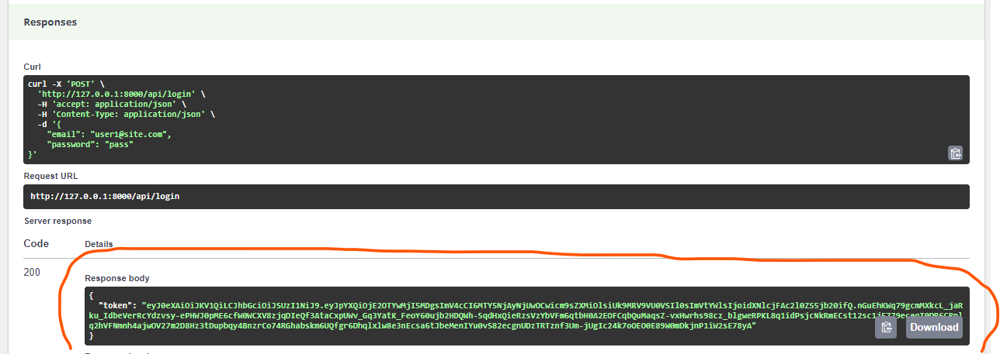

# Utilisation


## Les `User` disponibles :

- `ROLE_USER`

```bash
    {
        "email": "user1@site.com",
        "password": "pass"
    }
```

- `ROLE_ADMIN`

```bash
    {
        "email": "admin1@site.com",
        "password": "pass"
    }
```


## Générer un token JWT 


### Méthode ( 1 ) : Utiliser PostMan

-   https://www.postman.com/

-  Envoyer une nouvelle requête POST à `http://127.0.0.1:8000/api/login` :


    


## Méthode ( 2 ) : Utiliser l'interface `http://127.0.0.1:8000/api`

- Clicker sur `Login Check`

    


- Clicker sur `Try it out`

    


- Insérer l'objet JSON contenant le email et le mot de passe et executez :
    ```bash
        {
            "email": "user1@site.com",
            "password": "pass"
        }
    ```
    


- Recupérer le token (le string entre les guillemets)
    


## Utiliser un token dans une reqête sécurisée

### Méthode ( 1 ) : Utiliser PostMan pour une seul requête


### Méthode ( 2 ) : Lors du développement et pour faire des tests sur l'interface API, donner authorisation à toutes les requêtes

- Click sur le bouton `Authorize`

    

    


- Taper le string `Bearer` et un `espace` et coller le token
- Click sur le bouton `Autorize`

    


